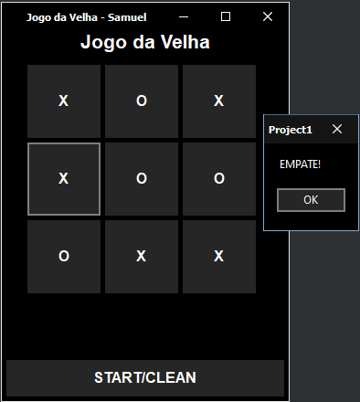

# Jogo da Velha (Tic-Tac-Toe)
---

### Regras do Jogo
---
- O jogo é jogado em um tabuleiro 3x3, com 9 células.
- Um jogador usa o símbolo "X" e o outro jogador usa o símbolo "O".
- Cada jogador, por sua vez, coloca seu símbolo em uma célula vazia do tabuleiro.
- O primeiro jogador a alinhar três símbolos consecutivos (na horizontal, vertical ou diagonal) ganha o jogo.
- Se todas as células forem preenchidas e ninguém tiver alinhado três símbolos consecutivos, o jogo termina em empate.

### Como Funciona o Código
---

No código fornecido, a implementação do Jogo da Velha segue a estrutura básica do jogo:

#### 1. **Inicialização do Jogo**
   - O tabuleiro é representado por uma matriz 3x3, onde cada célula inicia vazia (-10), que pode vir ser ocupada por "X" (1) ou ocupada por "O" (0).
   - O botão "START/CLEAN" inicia o jogo e habilita os botões para que os jogadores possam fazer suas jogadas e limpa tudo que já estiver marcado.

#### 2. **Jogadas dos Jogadores**
   - O jogador humano começa clicando em uma célula do tabuleiro.
   - A célula é marcada com "X", e a matriz é atualizada.
   - Após cada jogada do jogador, o código verifica se alguém venceu ou se o jogo terminou em empate.

#### 3. **Validação do Jogo**
   - O código verifica se existe uma linha, coluna ou diagonal com três símbolos iguais ("X" ou "O"). Caso exista, o jogo termina com vitória para o jogador correspondente.
   - A verificação de empate ocorre quando o jogador "O" (jogador 2) realiza 5 jogadas e o tabuleiro não apresenta vencedor.

#### 4. **Mensagens Finais**
   - Se um jogador vencer, uma mensagem é exibida indicando quem venceu (X ou O).
   - Se houver empate, uma mensagem de empate é exibida.

### Como Jogar
---
1. Clique no botão "START?CLEAN" para começar o jogo.
2. O jogador "X" (humano) escolhe uma célula vazia no tabuleiro.
3. O outro jogador "O" (também humano) escolhe uma célula vazia no tabuleiro.
4. O jogo continua até que um jogador vença ou o jogo termine em empate.

### Condições de Vitória

- **Linha horizontal**: Três símbolos iguais na mesma linha.
- **Linha vertical**: Três símbolos iguais na mesma coluna.
- **Diagonal**: Três símbolos iguais na diagonal (da esquerda para a direita ou da direita para a esquerda).

### Empate

O jogo termina em empate quando:
- Todas as células são preenchidas.
- Nenhum dos jogadores conseguiu alinhar três símbolos consecutivos.

### Alterações no Código

- **Incremento de jogadas dos jogadores**: Quando esse contador de "JogadasX" chega a 5, o código verifica a possibilidade de empate.
- **Validação de empate**: Após a quinta jogada do jogador "X", o código verifica se o jogo deve terminar em empate caso não haja vencedor.

---

## Como Executar o Jogo

1. Compile o projeto em Delphi ou C++ Builder ou RAD embarcadero.
2. O executável gerado pode ser encontrado no diretório: 
jogoDaVelha\Win32\Debug
   

